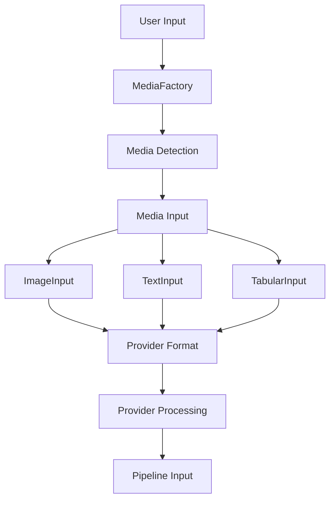
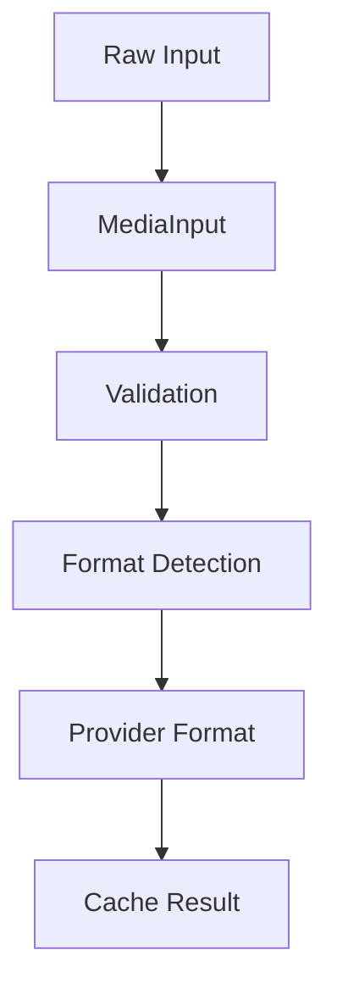

# Media Handling System

The media module provides a robust system for handling various types of media inputs in AbstractLLM. It's designed to be extensible, provider-agnostic, and easy to use.

## Architecture



## Core Components

1. **MediaInput Interface** (`interface.py`):
   - Abstract base class for all media types
   - Provider format conversion
   - Metadata management
   - Resource cleanup

2. **MediaFactory** (`factory.py`):
   - Media type detection
   - Input validation
   - Format conversion
   - Resource management

3. **Media Processor** (`processor.py`):
   - Provider-specific formatting
   - Input combination
   - Batch processing
   - Error handling

## Media Types

### Images (`image.py`)
- **Supported Formats**: JPEG, PNG, GIF, WebP, BMP
- **Input Sources**:
  - File paths
  - URLs
  - Base64 data
  - Raw bytes
- **Features**:
  - Format detection
  - Resolution optimization
  - Format caching
  - Provider-specific formatting
- **Provider Support**:
  - OpenAI: Base64 with detail level
  - Anthropic: Base64 with media type
  - HuggingFace: PIL Image or path
  - Ollama: Base64 or URL

### Text (`text.py`)
- **Supported Formats**:
  - Plain text
  - Markdown
  - PDF documents
  - DOCX files
  - JSON
- **Features**:
  - Text extraction
  - Document structure
  - Encoding handling
  - Format conversion
- **Provider Support**:
  - OpenAI: Plain text or chat
  - Anthropic: Plain text
  - HuggingFace: Raw text
  - Ollama: Plain text

### Tabular (`tabular.py`)
- **Supported Formats**:
  - CSV
  - TSV
  - Excel (planned, low priority)
- **Features**:
  - Delimiter detection
  - Header handling
  - Data type inference
  - Format conversion
- **Provider Support**:
  - All providers: Markdown tables

## Provider Integration

### Format Conversion Flow


### Resource Management


## Error Handling

### Media Processing Errors
- Format validation
- File access issues
- URL download problems
- Conversion errors
- Resource limits

### Provider Format Errors
- Invalid format
- Size limits
- Unsupported features
- Resource cleanup

## Usage Examples

### Basic Usage
```python
from abstractllm.media import MediaFactory

# Create from file
image = MediaFactory.from_source("image.jpg")
text = MediaFactory.from_source("document.pdf")
data = MediaFactory.from_source("data.csv")

# Create from URL
image = MediaFactory.from_source("https://example.com/image.jpg")

# Create from base64
image = MediaFactory.from_source(base64_string, media_type="image")

# Get provider-specific format
openai_format = image.to_provider_format("openai")
anthropic_format = image.to_provider_format("anthropic")
```

### Batch Processing
```python
# Process multiple files
inputs = MediaFactory.from_sources([
    "image1.jpg",
    "image2.png",
    "document.pdf"
])

# Process with provider
for media_input in inputs:
    provider_format = media_input.to_provider_format("openai")
```

## Implementation Guide

### Adding New Media Types
```python
class NewMediaInput(MediaInput):
    def __init__(self, source: Union[str, Path], **kwargs):
        self.source = source
        self._validate_source()
        self._cache = {}
        
    def to_provider_format(self, provider: str) -> Any:
        if provider in self._cache:
            return self._cache[provider]
            
        result = self._format_for_provider(provider)
        self._cache[provider] = result
        return result
        
    @property
    def media_type(self) -> str:
        return "new_type"
```

### Provider Format Implementation
```python
def _format_for_provider(self, provider: str) -> Any:
    if provider == "openai":
        return self._format_for_openai()
    elif provider == "anthropic":
        return self._format_for_anthropic()
    elif provider == "huggingface":
        return self._format_for_huggingface()
    elif provider == "ollama":
        return self._format_for_ollama()
    else:
        raise ValueError(f"Unsupported provider: {provider}")
``` 