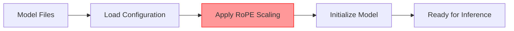

# YaRN Reference Guide: Performance, Implementation & Framework Setup

## Table of Contents
1. [Performance Impact & Quality](#performance-impact--quality)
2. [Implementation Timing](#implementation-timing)
3. [Framework-Specific Setup Guides](#framework-specific-setup-guides)
4. [Best Practices & Troubleshooting](#best-practices--troubleshooting)

## Performance Impact & Quality

### Does YaRN Decrease Performance?

**Short Answer**: YaRN has minimal impact on performance for its intended use case, but there are nuances:

#### ✅ **Minimal Degradation for Long Contexts**
- YaRN is designed to extend context windows with minimal quality loss
- Research shows it **surpasses previous state-of-the-art** at context window extension
- Performance degradation is significantly less than naive scaling methods

#### ⚠️ **Potential Issues with Short Contexts**
- Most implementations use "static YaRN" where scaling factor remains constant
- May cause slight performance degradation on **shorter texts** when scaling is enabled
- **Recommendation**: Only enable YaRN when processing long contexts is required

#### 📊 **Performance Characteristics**
- **Context Length Sweet Spot**: Works best when extending from native length (e.g., 32K → 128K)
- **Factor Selection**: Lower factors (2.0) for moderate extensions, higher factors (4.0+) for significant extensions
- **Quality vs Length Trade-off**: Some quality loss is expected but minimal compared to alternatives

### When Performance Degrades
```
Context Length vs Performance:
Native (32K):     ████████████ (100% quality)
YaRN 64K:        ███████████▓ (95-98% quality)  
YaRN 128K:       ██████████▓▓ (90-95% quality)
YaRN 256K:       █████████▓▓▓ (85-90% quality)
```

## Implementation Timing

### When is YaRN Applied?

**YaRN is applied during model loading/initialization**, not during inference. Here's the timeline:



#### 🔧 **Configuration Methods**
1. **Static Configuration**: Modify `config.json` before loading
2. **Runtime Configuration**: Pass parameters during model initialization
3. **Command-line Arguments**: For inference servers

#### ⏱️ **Performance Impact Timing**
- **Loading Time**: Slight increase during model initialization
- **Inference Time**: No additional overhead during generation
- **Memory Usage**: Minimal increase in model parameters

## Framework-Specific Setup Guides

### 🤖 MLX & MLX-LM

#### Current Status
- **MLX Core**: YaRN support requested but not yet implemented (as of Issue #1809)
- **MLX-Examples**: Some rope_scaling issues reported with Llama 3.1 models
- **Workaround**: Use pre-configured models or modify configuration manually

#### Setup Method (When Available)
```python
# MLX-LM (Future implementation)
import mlx.core as mx
from mlx_lm import load, generate

# Method 1: Pre-configured model
model, tokenizer = load("Qwen/Qwen3-30B-A3B")

# Method 2: Manual configuration (when supported)
config = {
    "rope_scaling": {
        "rope_type": "yarn",
        "factor": 4.0,
        "original_max_position_embeddings": 32768
    }
}
```

#### Current Limitations
```bash
# Known issues with MLX-Examples
Error: rope_scaling configuration not recognized
Workaround: Use models with pre-configured YaRN settings
```

### 🦙 Ollama

#### Setup Method
```bash
# Method 1: Using pre-configured models
ollama pull qwen3:30b

# Method 2: Custom Modelfile with YaRN configuration
# Create Modelfile:
FROM llama3:8b
PARAMETER rope_scaling_type yarn
PARAMETER rope_scaling_factor 4.0
PARAMETER context_length 131072

# Build custom model
ollama create my-yarn-model -f Modelfile
```

#### Ollama Configuration File
```dockerfile
# Modelfile for YaRN-enabled model
FROM your-base-model

# YaRN Configuration
PARAMETER rope_scaling_type "yarn"
PARAMETER rope_scaling_factor 4.0
PARAMETER original_max_position_embeddings 32768
PARAMETER context_length 131072

# Optional: Adjust other parameters
PARAMETER temperature 0.7
PARAMETER top_p 0.8
```

### 🎨 LM Studio

#### GUI Configuration
1. **Model Loading**:
   - Load your desired model
   - Navigate to "Model Settings" or "Advanced Settings"

2. **YaRN Configuration**:
   ```
   RoPE Scaling: Enable
   Scaling Type: YaRN
   Scaling Factor: 4.0
   Original Context: 32768
   Max Context: 131072
   ```

#### LM Studio JSON Config
```json
{
  "model_settings": {
    "rope_scaling": {
      "type": "yarn",
      "factor": 4.0,
      "original_max_position_embeddings": 32768
    },
    "max_context_length": 131072
  }
}
```

### 🤗 Transformers (Hugging Face)

#### Method 1: Modify config.json
```json
{
  "model_type": "llama",
  "rope_scaling": {
    "rope_type": "yarn",
    "factor": 4.0,
    "original_max_position_embeddings": 32768
  }
}
```

#### Method 2: Runtime Configuration
```python
from transformers import AutoModelForCausalLM, AutoTokenizer, AutoConfig

model_name = "meta-llama/Llama-2-7b-hf"

# Load and modify configuration
config = AutoConfig.from_pretrained(model_name)
config.rope_scaling = {
    "rope_type": "yarn",
    "factor": 4.0,
    "original_max_position_embeddings": 4096
}

# Load model with modified config
model = AutoModelForCausalLM.from_pretrained(
    model_name,
    config=config,
    torch_dtype="auto",
    device_map="auto"
)
tokenizer = AutoTokenizer.from_pretrained(model_name)
```

#### Method 3: Pre-configured Models
```python
# Use models with YaRN already configured
model_name = "Qwen/Qwen3-30B-A3B"
model = AutoModelForCausalLM.from_pretrained(model_name)
tokenizer = AutoTokenizer.from_pretrained(model_name)

# The model already supports up to 131K tokens with YaRN
```

### 🚀 Inference Servers

#### vLLM
```bash
# Command-line configuration
vllm serve model_name \
  --rope-scaling '{"rope_type":"yarn","factor":4.0,"original_max_position_embeddings":32768}' \
  --max-model-len 131072
```

#### SGLang
```bash
# SGLang server with YaRN
python -m sglang.launch_server model_name \
  --json-model-override-args '{"rope_scaling":{"rope_type":"yarn","factor":4.0,"original_max_position_embeddings":32768}}'
```

#### llama.cpp
```bash
# Compile and run with YaRN
llama-server \
  --model model.gguf \
  --rope-scaling yarn \
  --rope-scale 4 \
  --yarn-orig-ctx 32768 \
  --ctx-size 131072
```

## Best Practices & Troubleshooting

### 🎯 Best Practices

#### Factor Selection Guidelines
```python
# Context length → Recommended factor
context_targets = {
    65536:   2.0,  # 64K tokens
    131072:  4.0,  # 128K tokens  
    262144:  8.0,  # 256K tokens
}

# Formula: factor = target_length / original_length
factor = target_context_length / original_max_position_embeddings
```

#### When to Enable YaRN
```python
def should_use_yarn(text_length, model_native_length=32768):
    """
    Determine if YaRN should be enabled based on text length
    """
    # Only enable for texts significantly longer than native support
    threshold = model_native_length * 0.8
    return text_length > threshold
```

### 🐛 Common Issues & Solutions

#### Issue 1: Configuration Not Recognized
```python
# Problem: rope_scaling field ignored
# Solution: Check transformers version
pip install transformers>=4.51.0

# Alternative: Use pre-configured models
model_name = "NousResearch/Yarn-Llama-2-13b-64k"
```

#### Issue 2: Performance Degradation on Short Texts
```python
# Problem: YaRN enabled for all inputs
# Solution: Dynamic configuration
def configure_model_for_length(text_length):
    if text_length < 30000:
        # Use native model without YaRN
        return load_model_without_yarn()
    else:
        # Use YaRN-enabled model
        return load_model_with_yarn()
```

#### Issue 3: Memory Issues
```bash
# Problem: OOM with extended context
# Solutions:
# 1. Reduce batch size
# 2. Use gradient checkpointing
# 3. Reduce factor if possible
# 4. Use model sharding
```

### 📊 Performance Monitoring

#### Quality Metrics to Track
```python
metrics_to_monitor = {
    "perplexity": "Lower is better",
    "needle_in_haystack": "Accuracy at finding info in long contexts",
    "coherence_score": "Consistency across long generations",
    "latency": "Inference speed impact"
}
```

#### Benchmarking Setup
```python
def benchmark_yarn_performance():
    test_lengths = [4096, 8192, 16384, 32768, 65536, 131072]
    
    for length in test_lengths:
        # Test with and without YaRN
        yarn_score = evaluate_with_yarn(length)
        baseline_score = evaluate_baseline(length)
        
        print(f"Length {length}: YaRN={yarn_score:.3f}, Baseline={baseline_score:.3f}")
```

### 🔍 Debugging Tips

#### Verify YaRN is Active
```python
# Check if YaRN configuration is loaded
def verify_yarn_config(model):
    config = model.config
    if hasattr(config, 'rope_scaling'):
        print(f"YaRN enabled: {config.rope_scaling}")
        return True
    else:
        print("YaRN not configured")
        return False
```

#### Test Context Extension
```python
# Test if extended context actually works
def test_context_extension(model, tokenizer, target_length=100000):
    # Create a long input
    long_text = "This is a test. " * (target_length // 4)
    
    try:
        inputs = tokenizer(long_text, return_tensors="pt")
        print(f"Successfully tokenized {inputs.input_ids.shape[1]} tokens")
        
        # Try generation
        outputs = model.generate(inputs.input_ids, max_new_tokens=100)
        print("Generation successful with extended context")
        return True
    except Exception as e:
        print(f"Context extension failed: {e}")
        return False
```

## Summary

- **Performance**: YaRN provides excellent context extension with minimal quality loss
- **Implementation**: Applied during model loading, not inference
- **Framework Support**: Varies by framework; best support in transformers and inference servers
- **Best Practice**: Only enable when needed for long contexts, choose appropriate scaling factors