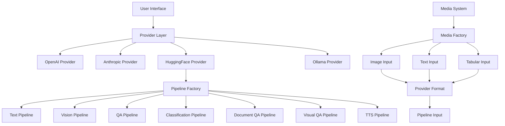
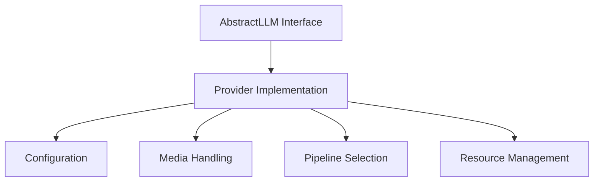
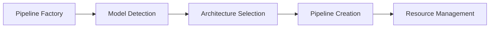
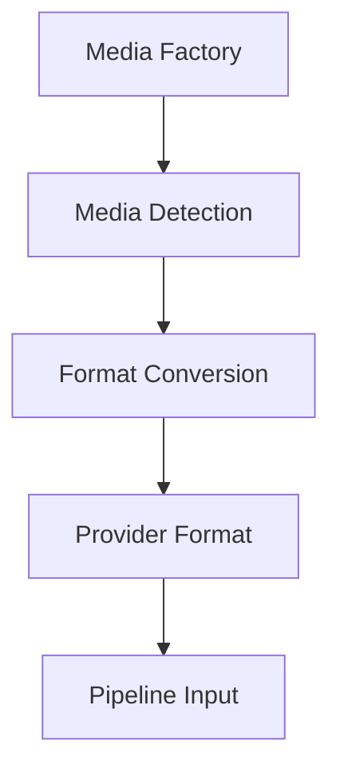
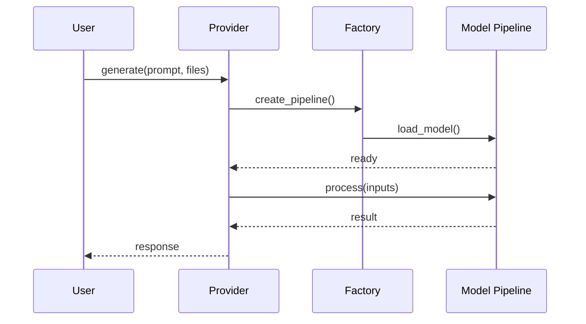
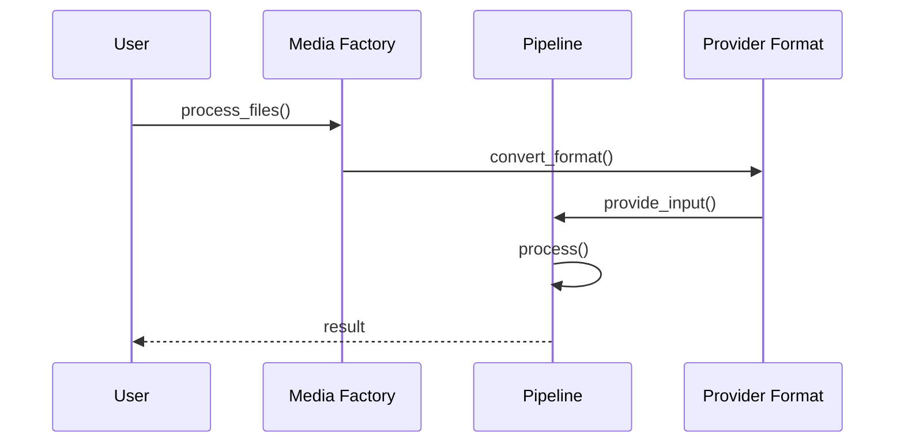
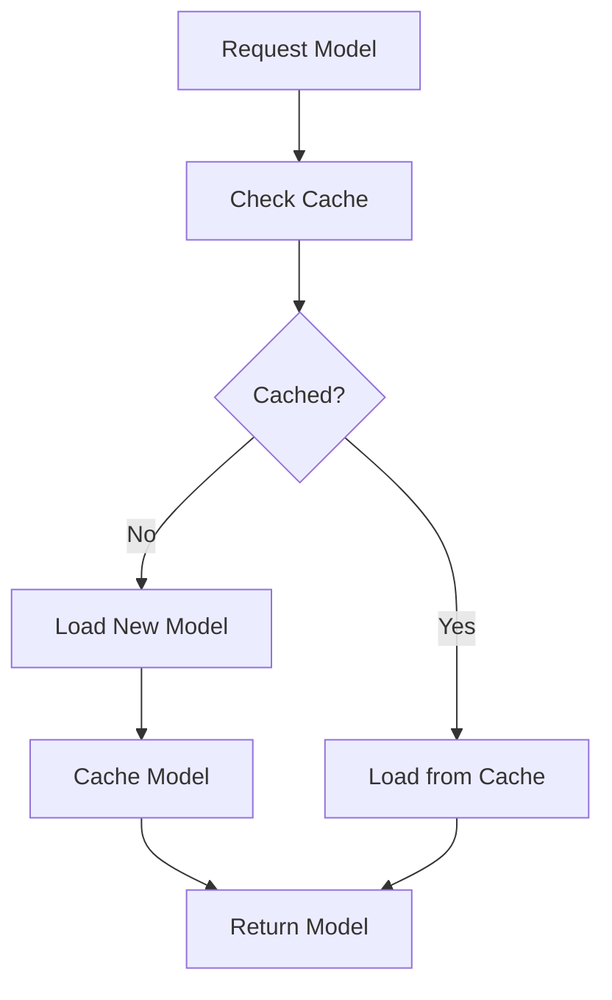
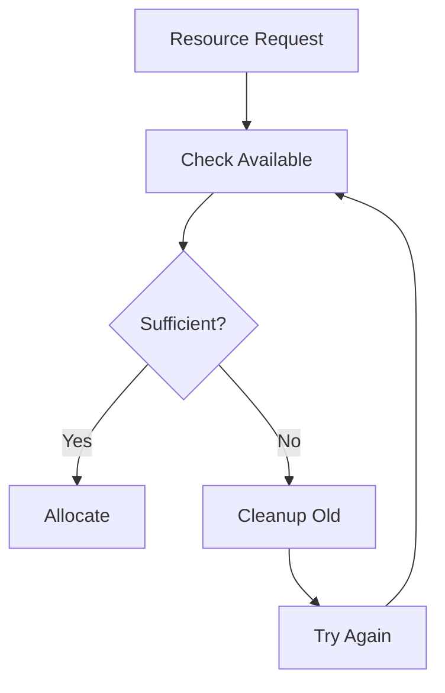
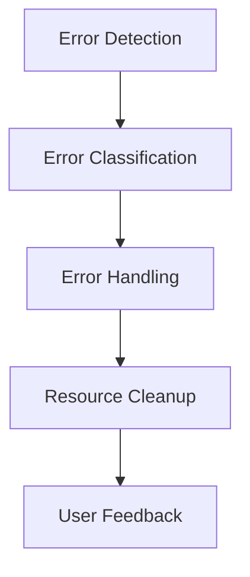

# AbstractLLM Architecture

## Overview

AbstractLLM is designed with modularity and extensibility in mind, built around three core concepts:
1. Provider abstraction
2. Pipeline-based model handling
3. Unified media processing

## System Architecture



## Core Components

### 1. Provider Layer
The provider layer implements the AbstractLLM interface for different LLM providers:



### 2. Pipeline System
The pipeline system manages different model architectures:



Currently implemented pipelines:
- Text Generation (CAUSAL_LM)
- Text-to-Text (SEQ2SEQ_LM)
- Image-to-Text (VISION2SEQ)
- Question Answering (QUESTION_ANSWERING)
- Text Classification (TEXT_CLASSIFICATION)
- Document QA (DOCUMENT_QA)
- Visual QA (VISUAL_QA)
- Text-to-Speech (TEXT_TO_SPEECH)

Planned pipelines:
- Token Classification (TOKEN_CLASSIFICATION)
- Speech-to-Text (SPEECH_TO_TEXT)

### 3. Media System
The media system handles various input types:



## Component Interactions

### Provider to Pipeline Flow


### Media to Pipeline Flow


## Resource Management

### Model Loading


### Memory Management


## Error Handling



## Extension Points

1. **New Providers**:
   ```python
   class NewProvider(AbstractLLMInterface):
       def __init__(self, config: Optional[Dict[str, Any]] = None):
           super().__init__(config)
           
       def generate(self, prompt: str, **kwargs) -> str:
           # Implementation
           pass
   ```

2. **New Pipelines**:
   ```python
   class NewPipeline(BasePipeline):
       def load(self, model_name: str, config: ModelConfig) -> None:
           # Load model and components
           pass
           
       def process(self, inputs: List[MediaInput], **kwargs) -> Any:
           # Process inputs
           pass
   ```

3. **New Media Types**:
   ```python
   class NewMediaInput(MediaInput):
       def to_provider_format(self, provider: str) -> Any:
           # Convert to provider format
           pass
           
       @property
       def media_type(self) -> str:
           return "new_type"
   ```

## Cross-References
- [Data Flow Documentation](data_flow.md)
- [Media System Documentation](../abstractllm/media/README.md)
- [Pipeline Implementation Guide](../abstractllm/providers/huggingface/README.md) 