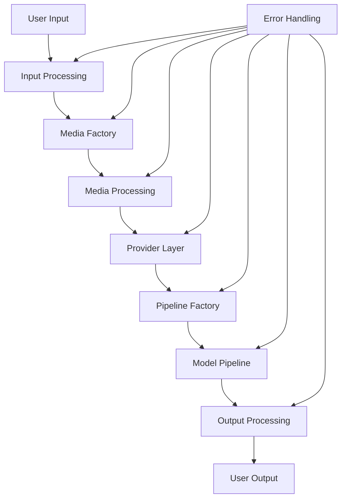
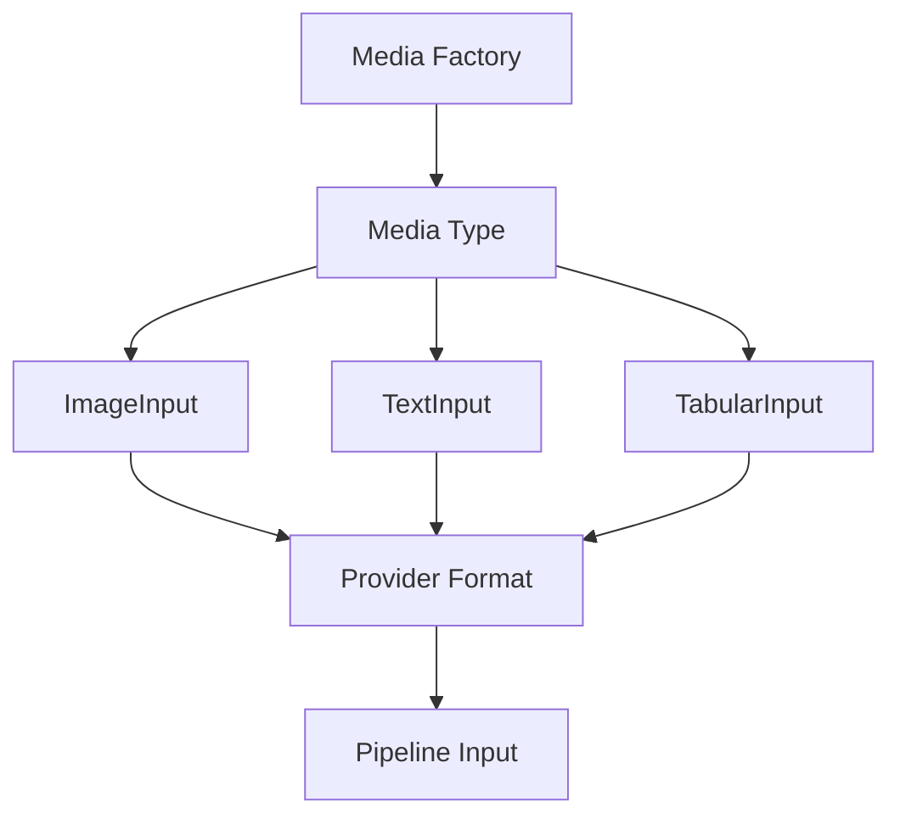
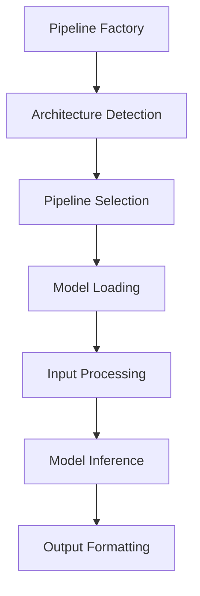
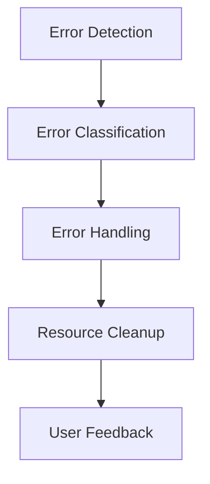
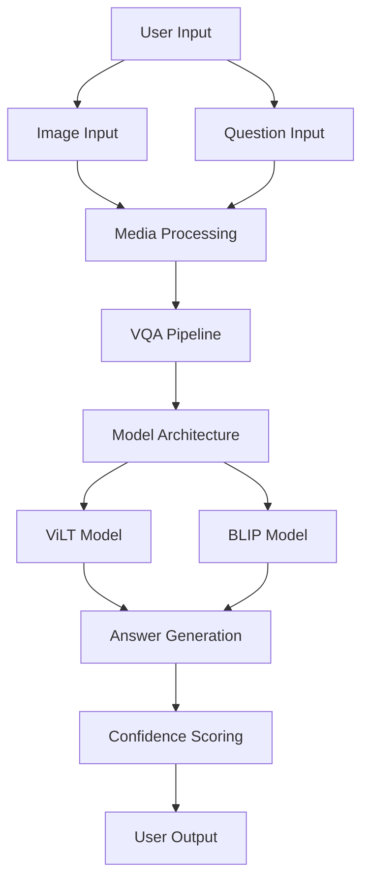

# Data Flow in AbstractLLM

This document describes how data flows through the AbstractLLM system, from input to output.

## System Overview



## Core Components Flow

### 1. Input Processing


### 2. Media Processing


### 3. Pipeline Processing


### 4. Error Flow


### Visual Question Answering Flow


The VQA pipeline handles:
1. **Input Processing**:
   - Image validation and preprocessing
   - Question text formatting
   - Multiple choice answer preparation
2. **Model Selection**:
   - ViLT for structured VQA
   - BLIP for open-ended questions
3. **Answer Generation**:
   - Multiple choice answer selection
   - Free-form answer generation
   - Confidence score calculation
4. **Output Formatting**:
   - Answer text
   - Confidence scores
   - Optional model logits

## Component Interactions

### Media System to Pipeline
```