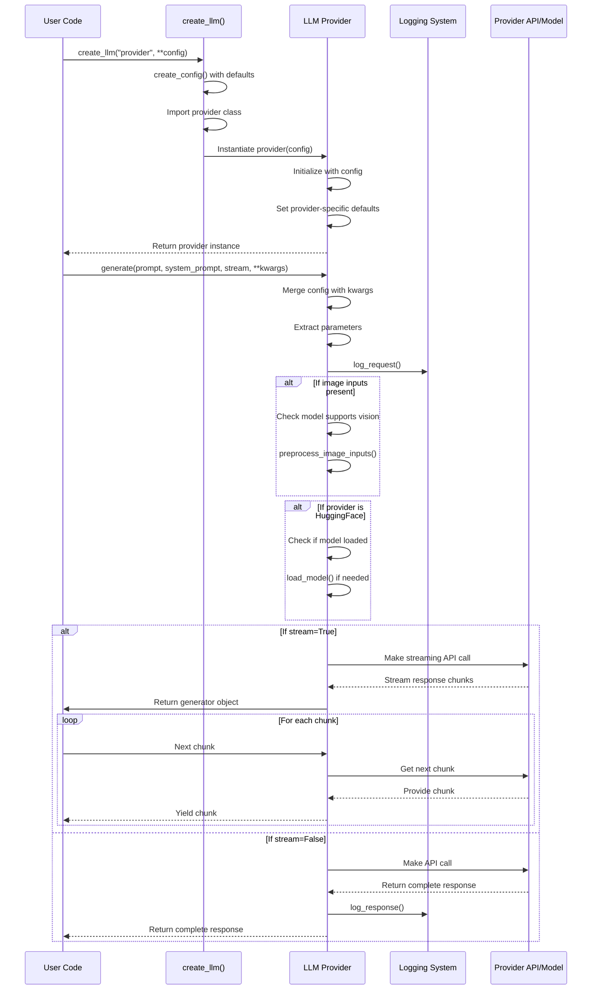
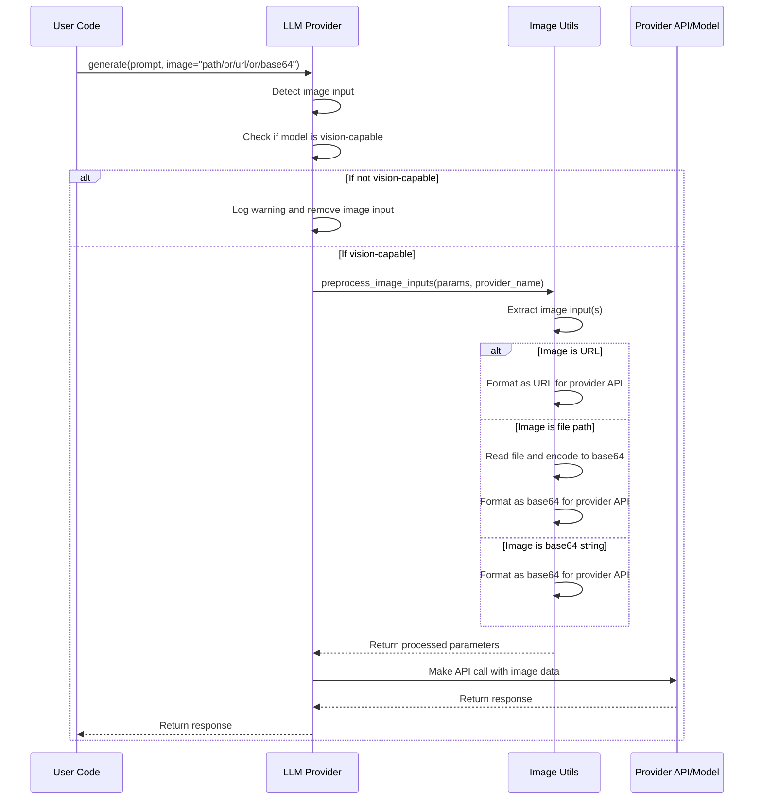
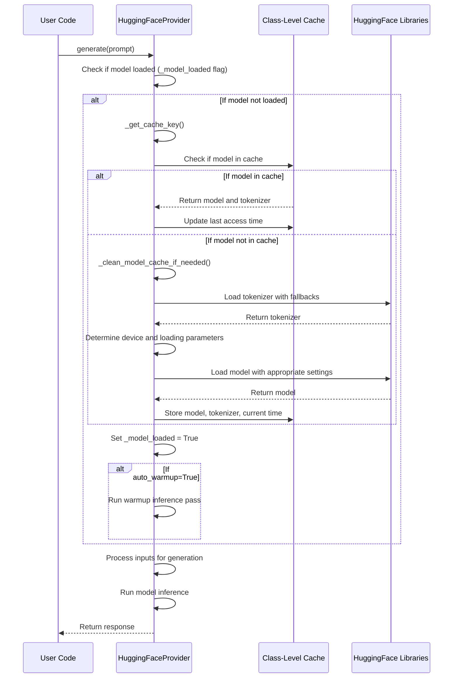
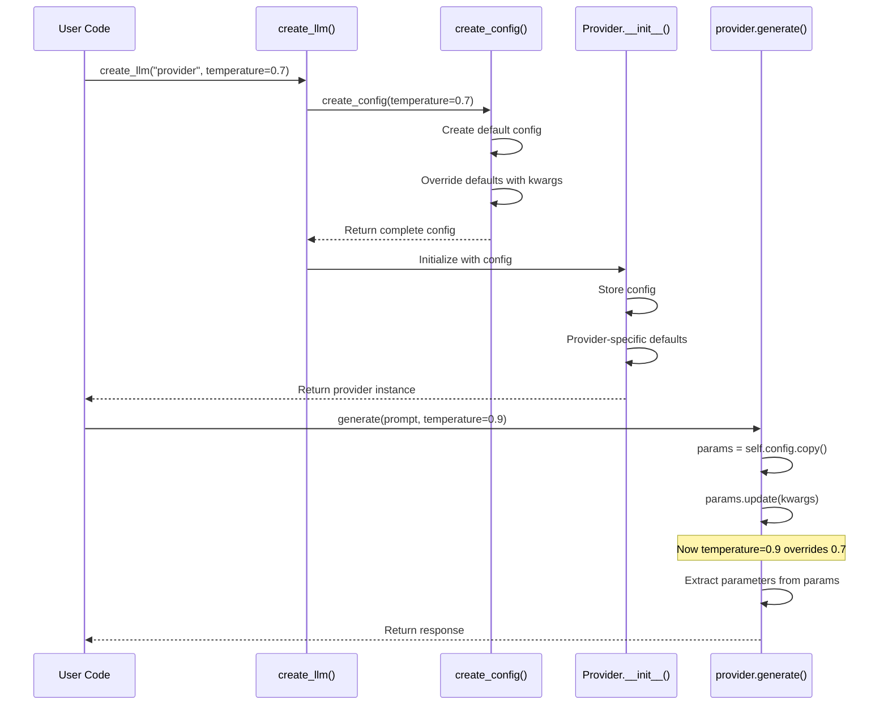
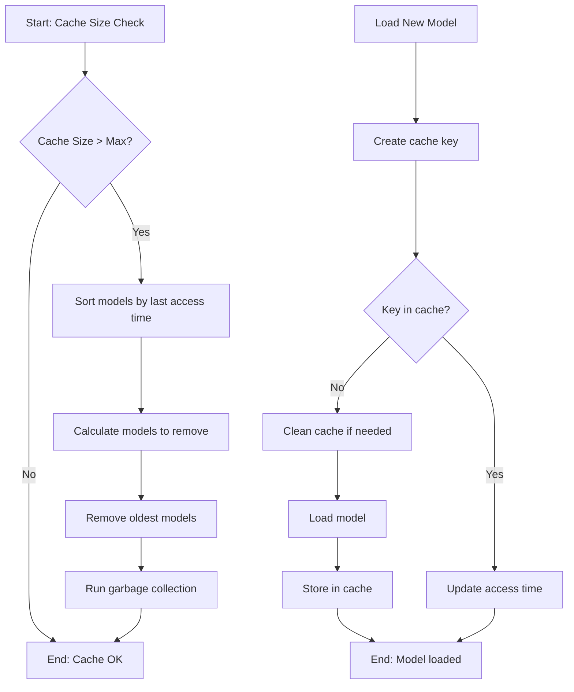
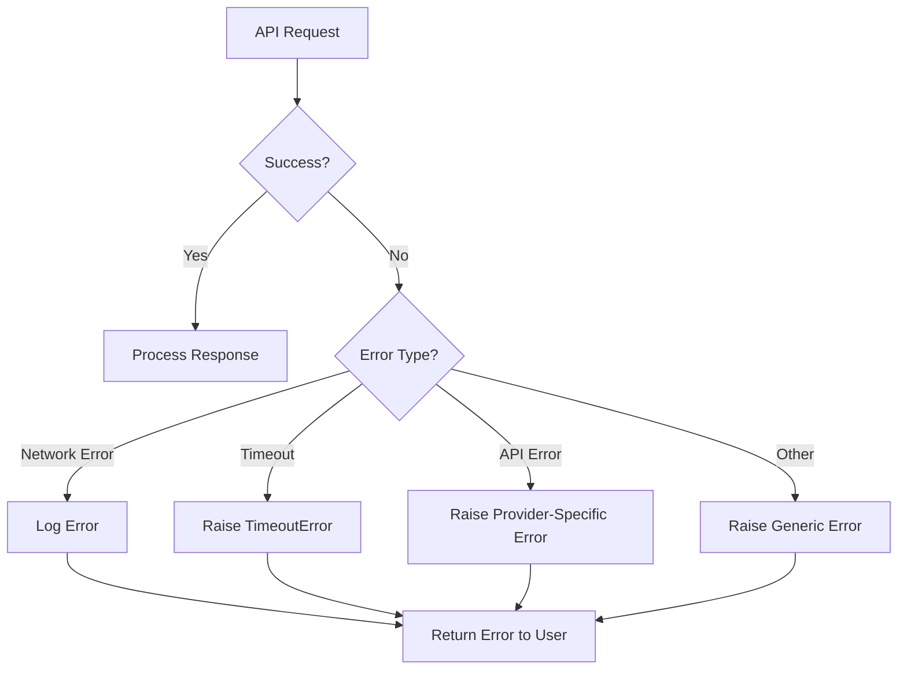

# Data Flow and Call Stack Analysis

This document provides a detailed technical analysis of the data flow and call stacks within AbstractLLM. Understanding these flows is essential for developers working with or extending the library.

## Core Request Flow

The following diagram illustrates the complete flow of a typical text generation request from user code to the LLM response:



## Image Processing Flow

When processing image inputs for vision-capable models, the following flow occurs:



## HuggingFace Model Loading and Caching Flow

The HuggingFace provider has a unique flow for model loading and caching:



## Method Call Hierarchy

### Factory Initialization

```
create_llm(provider, **config)
├── _PROVIDERS mapping lookup
├── importlib.import_module()
├── getattr(module, class_name)
├── create_config(**config)
└── provider_class(config=provider_config)
    └── AbstractLLMInterface.__init__(config)
        └── Provider-specific initialization
```

### OpenAI Generation

```
OpenAIProvider.generate(prompt, system_prompt, stream, **kwargs)
├── Merge config with kwargs
├── Extract parameters
├── Check for image inputs
│   └── preprocess_image_inputs() if needed
├── log_request()
├── Prepare request payload
├── If stream=True:
│   ├── Make streaming API call
│   └── Return generator that yields chunks
└── If stream=False:
    ├── Make standard API call
    ├── Process response
    ├── log_response()
    └── Return complete response
```

### HuggingFace Generation

```
HuggingFaceProvider.generate(prompt, system_prompt, stream, **kwargs)
├── Merge config with kwargs
├── Extract parameters
├── Check for image inputs
│   └── preprocess_image_inputs() if needed
├── log_request()
├── If not _model_loaded:
│   └── load_model()
│       ├── _get_cache_key()
│       ├── Check class-level cache
│       ├── _clean_model_cache_if_needed() if needed
│       ├── Load tokenizer
│       ├── Load model
│       └── Store in cache
├── Prepare system prompt and user prompt
├── Tokenize input
├── Set up generation config
├── If stream=True:
│   ├── _stream_generator() or _phi4_multimodal_stream_generator()
│   └── Return generator that yields tokens
└── If stream=False:
    ├── model.generate()
    ├── Decode output
    ├── Extract generated text
    ├── log_response()
    └── Return complete response
```

## Async Flow Implementation

### HuggingFace Async Implementation

The HuggingFace provider implements async generation by wrapping the synchronous implementation with ThreadPoolExecutor:

```python
async def generate_async(self, prompt, system_prompt, stream, **kwargs):
    if stream:
        # Create an async generator that wraps the sync generator
        async def async_generator():
            with ThreadPoolExecutor() as executor:
                # Run sync generate in a thread
                gen_future = executor.submit(
                    self.generate, prompt, system_prompt, True, **kwargs
                )
                
                # Get the sync generator
                sync_gen = await asyncio.to_thread(lambda: gen_future.result())
                
                # Yield from the sync generator
                for chunk in sync_gen:
                    yield chunk
        
        return async_generator()
    else:
        # For non-streaming, run sync method in a thread
        return await asyncio.to_thread(
            self.generate, prompt, system_prompt, False, **kwargs
        )
```

### Ollama Native Async Implementation

The Ollama provider implements async generation natively using aiohttp:

```python
async def generate_async(self, prompt, system_prompt, stream, **kwargs):
    # ... parameter processing ...
    
    if stream:
        async def async_generator():
            async with aiohttp.ClientSession() as session:
                async with session.post(url, json=payload) as response:
                    async for line in response.content:
                        if line:
                            data = json.loads(line)
                            yield data["response"]
        
        return async_generator()
    else:
        async with aiohttp.ClientSession() as session:
            async with session.post(url, json=payload) as response:
                result = await response.json()
                return result["response"]
```

## Configuration Flow

The following sequence diagram illustrates how configuration flows through the system:



## Memory Management Flow

The following diagram illustrates the memory management flow in the HuggingFace provider:



## Error Handling Flow



## Call Stack Examples

### OpenAI Text Generation

```
User code
└── create_llm("openai", **config)
    └── OpenAIProvider.__init__(config)
        └── AbstractLLMInterface.__init__(config)

User code
└── provider.generate("Hello", system_prompt="You are helpful", temperature=0.7)
    ├── OpenAIProvider.generate(prompt, system_prompt, stream=False, **kwargs)
    │   ├── params = self.config.copy()
    │   │   └── params.update(kwargs)
    │   ├── log_request("openai", prompt, parameters)
    │   ├── openai.chat.completions.create(**params)
    │   └── log_response("openai", result)
    └── Return result
```

### HuggingFace Vision Generation

```
User code
└── create_llm("huggingface", model="microsoft/Phi-4-multimodal-instruct")
    └── HuggingFaceProvider.__init__(config)
        └── AbstractLLMInterface.__init__(config)
            └── _device = _get_optimal_device()

User code
└── provider.generate("Describe this image", image="path/to/image.jpg")
    ├── HuggingFaceProvider.generate(prompt, image=path)
    │   ├── params = self.config.copy()
    │   │   └── params.update(kwargs)
    │   ├── Check if model is vision-capable
    │   ├── preprocess_image_inputs(params, "huggingface")
    │   │   └── format_image_for_provider(image, "huggingface")
    │   ├── load_model() if not loaded
    │   │   ├── _get_cache_key()
    │   │   └── Class-level model cache check
    │   ├── Process image with model processor
    │   ├── model.generate() with image inputs
    │   └── Return processed response
    └── Return result
```

## Performance Considerations

The call stack analysis reveals several performance optimizations in the library:

1. **Lazy Loading**: Models are only loaded when needed
2. **Caching**: The HuggingFace provider implements class-level caching
3. **Selective Imports**: Dependencies are imported only when required
4. **ThreadPoolExecutor**: Used for running synchronous code asynchronously
5. **Device Optimization**: Automatic device detection for optimal performance

## Thread and Process Management

The library primarily operates in a single-threaded manner, with the following exceptions:

1. **Async Generation**: Uses ThreadPoolExecutor for non-blocking operation
2. **HuggingFace Model Loading**: Some operations can utilize multiple threads internally 
3. **PyTorch Operations**: May use multiple threads for tensor operations

There is no explicit multiprocessing in the library, making it suitable for integration into both synchronous and asynchronous application architectures. 